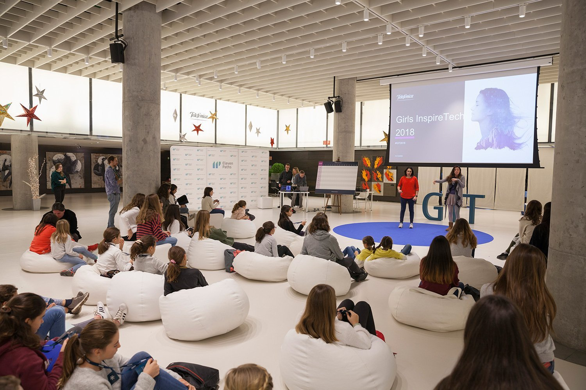

# Acerca de GIT (Girls Inspire Tech)

Con el hashtag #MujeresHacker, [Telefónica](https://www.telefonica.com/es/home) presenta una iniciativa para apoyar el sueño de las niñas que desean ser programadoras, matemáticas e ingenieras, para que la brecha de género disminuya en el acceso a estos estudios y en la posterior incorporación laboral.

GIT (Girls Inspire Tech) es un evento anual que reune a niñas de entre 10 a 14 años donde se quiere fomentar las disciplinas STEAM de mano de las #MujeresHacker de CDO, la unidad de datos de Telefónica.

## GIT2019

No dudes en participar este año: [agenda](index.md)

## Cómo colaborar

Si quieres participar o contar tu historia, puedes contactarnos a [mujereshacker@telefonica.com](mailto:mujereshacker@telefonica.com)

Además, estamos abiertas a sugerencias acerca de cómo mejorar estas sesiones. Puedes colaborar con este repositorio haciendo un [hacer un fork](https://help.github.com/articles/fork-a-repo/) y creando, posteriormente, un [pull request](https://help.github.com/articles/using-pull-requests/) para solucionar cualquier error que encuentres o añadir algún recurso o información.

**Cualquier ayuda es bienvenida, #mujereshacker :)**
