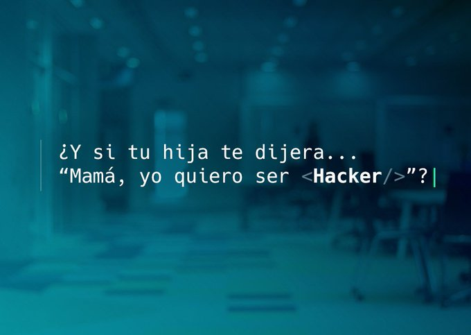

## Acerca de la iniciativa

Con el hasthag #MujeresHacker, [Telefónica](https://www.telefonica.com/es/home) presenta una iniciativa para apoyar el sueño de las niñas que desean ser programadoras, matemáticas e ingenieras, para que la brecha de género disminuya en el acceso a estos estudios y a la posterior incorporación laboral.

GIT2019 es un evento anual que reune a niñas dde entre 10 a 14 años donde se quiere fomentar las disciplinas STEAM de mano de las #MujeresHacker de CDO, la unidad de datos de Telefónica.

Proyectos como este hacen que estemos a la cabeza en el uso de la #IA en nuestro sector. Gracias por inspirarnos: http://tlfn.ca/ZraK30p2ZKz

## Cómo colaborar

Estamos abiertas a sugerencias acerca de cómo mejorar estas sesiones. Si quieres participar o contar tu historia, puedes contactarnos al email de mujereshacker@telefonica.com

Además, si tienes alguna sugerencia de contenido, puedes colaborar con este repositorio haciendo un [hacer un fork](https://help.github.com/articles/fork-a-repo/) y haciéndonos llegar, posteriormente, un [pull request](https://help.github.com/articles/using-pull-requests/) para solucionar cualquier error que encuentres o añadir algún recurso o información.

**Cualquier ayuda es bienvenida, #mujereshacker :)**
